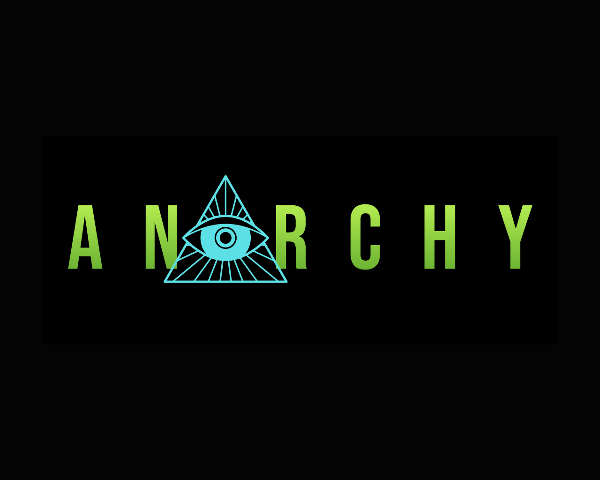

<p align="center">
  <a href="https://anarchy.ai/" target="_blank"></a>
  <a href="https://discord.gg/YmNvCAk6W6" target="_blank"></a>
  <a href="https://github.com/anarchy-ai/LLM-VM">
      
  </a>
</p>
<h1 align='center'> 🤖 Anarchy LLM-VM 🤖 </h1>
<p align='center'><em>An Open-Source AGI Server for Open-Source LLMs</em></p>

This is [Anarchy's](https://anarchy.ai) effort to build 🏗️ an open generalized artificial intelligence 🤖 through the LLM-VM: a way to give your LLMs superpowers 🦸 and superspeed 🚄.

You can find detailed instructions to try it live here: [anarchy.ai](https://anarchy.ai)

> This project is in BETA. Expect continuous improvement and development.


# Table of Contents

* [Table of Contents](#table)
* [About](#-about-)
    * [What](#-what-is-the-anarchy-llm-vm)
    * [Why](#-why-use-the-anarchy-llm-vm)
    * [Features and Roadmap](#-features-and-roadmap)
* [Quick Start and Installation](#-quickstart-)
   * [Requirements](#-requirements)
   * [Installation](#-installation)
   * [Generating Completions](#-generating-completions)
   * [Running LLMs Locally](#-running-llms-locally)
   * [Supported Models](#-supported-models)
   * [Picking Different Models](#-picking-different-models)
   * [Tool Usage](#-tool-usage)
* [Contributing](#-contributing-)

## 📚 About 📚

### 💁 What is the Anarchy LLM-VM?

The Anarchy LLM-VM is a highly optimized and opinionated backend for running LLMs with all the modern features we've come to expect from completion: tool usage, persistent stateful memory, live data augmentation, data and task fine-tuning, output templating, a web playground, api endpoints, student-teacher distillation, data synthesis, load-balancing and orchestration, large context-window mimicry.

Formally, it is a virtual machine/interpreter for human language, coordinating between data, models (CPU), your prompts (code), and tools (IO). 

By doing all these things in one spot in an opinionated way, the LLM-VM can properly optimize and batch calls that would be exorbitantly expensive with distributed endpoints.  It furthermore strives for both model and architecture agnosticism, properly optimizing the chosen model for the current architecture.

### 🤌 Why use the Anarchy LLM-VM?

In line with Anarchy's mission, the LLM-VM strives to support open-source models. By utilizing open-source models and running them locally you achieve a number of benefits:

* **Speed up your AGI development 🚀:** *With AnarchyAI, one interface is all you need to interact with the latest LLMs available.*
  
* **Lower your costs 💸:** *Running models locally can reduce the pay-as-you-go costs of development and testing.*
  
* **Flexibility 🧘‍♀️:** *AnarchyAI allows you to rapidly switch between popular models so you can pinpoint the exact right tool for your project.*
  
* **Community Vibes 🫂:** *Join our active community of highly motivated developers and engineers working passionately to democratize AGI*
  
* **WYSIWYG 👀:** *Open source means nothing is hidden; we strive for transparency and efficiency so you can focus on building.*

### 🎁 Features and Roadmap

* **Implicit Agents 🔧🕵️:** *The Anarchy LLM-VM can be set up to use external tools through our agents such as **REBEL** just by supplying tool descriptions!*

* **Inference Optimization 🚄:** *The Anarchy LLM-VM is optimized from agent level all the way to assembly on known LLM architectures to get the most bang for your buck. With state of the art batching, sparse inference and quantization, distillation, and multi-level colocation, we aim to provide the fastest framework available.*

* **Task Auto-Optimization 🚅:** *The Anarchy LLM-VM will analyze your use cases for repetative tasks where it can activate student-teacher distillation to train a super-efficient small model from a larger more general model without loosing accuracy.  It can furthermore take advantage of data-synthesis techniques to improve results.*


* **Library Callable 📚:** *We provide a library that can be used from any python codebase directly.*

* **HTTP Endpoints 🕸️:** *We provide an HTTP standalone server to handle completion requests.*

* **Live Data Augmentation 📊:** (ROADMAP) *You will be able to provide a live updating data-set and the Anarchy LLM-VM will **fine-tune** your models or work with a **vector DB** to provide up-to-date information with citations*

* **Web Playground 🛝:** (ROADMAP) *You will be able to run the Anarchy LLM-VM and test it's outputs from the browser.*

* **Load-Balancing and Orchestration ⚖️:** (ROADMAP) *If you have multiple LLMs or providers you'd like to utilize, you will be able to hand them to the Anarchy LLM-VM to automatically figure out which to work with and when to optimize your uptime or your costs*

* **Output Templating 🤵:** (ROADMAP) *You can ensure that the LLM only outputs data in specific formats and fills in variables from a template with either regular expressions, LMQL, or OpenAI's template language*

* **Persistent Stateful Memory 📝:** (ROADMAP) *The Anarchy LLM-VM can remember a user's conversation history and react accordingly*

## 🚀 Quickstart 🚀

### 🥹 Requirements

#### Installation Requirements

Python >=3.6 required, Python >= 3.10 recommended, Unix style operating system 

TODO: WRITE WELL

#### System Requirements

Different models have different system requirements. Limiting factors on most systems will likely be RAM, but many functions will work at even 16 GB of ram. 

TODO: PLEASE PUT SOMEHTING GOOD HERE

### 👨‍💻 Installation

To install the LLM-VM you simply need to download this repository and install it with pip like so:

```bash
> git clone https://github.com/anarchy-ai/LLM-VM.git
> cd LLM-VM
> pip3 install .
```
#### Developer Setup
the best way to test run code while writing a patch is to use 
`pip3 install --editable .`, which will expose the code as a library you can 
edit in place.

This will install both the library and test-server.  

### ✅ Generating Completions
Our LLM-VM gets you working directly with popular LLMs locally in just 3 lines. Once you've installed (as above), just load your model and start generating!


```python
# import our client
from llm_vm.client import Client

# Select which LLM you want to use, here we have openAI's 
client = Client(big_model = 'chat_gpt')

# Put in your prompt and go!
response = client.complete(prompt = 'What is Anarchy?', context = '', openai_key = 'ENTER_YOUR_API_KEY')
print(response)
# Anarchy is a political ideology that advocates for the absence of government...
```

### 🏃‍♀️ Running LLMs Locally
```python
# import our client
from llm_vm.client import Client

# Select the LlaMA model
client = Client(big_model = 'llama')

# Put in your prompt and go!
response = client.complete(prompt = 'What is Anarchy?', context = '')
print(response)
# Anarchy is a political philosophy that advocates no government...
```


### 😎 Supported Models
Select from the following models
```python
Supported_Models = ['chat_gpt','gpt','neo','llama','bloom','opt','pythia']
```


### ☯️ Picking Different Models
LLM-VM default model sizes for local models is intended to make experimentation 
with LLMs accessible to everyone, but if you have the memory required, larger parameter models 
will perform far better!

for example if you want to use a large and small neo model  for your teacher and student, and you 
have enough ram:


```python
# import our client
from llm_vm.client import Client

# Select the LlaMA model
client = Client(big_model = 'neo', big_model_config={'model_uri':'EleutherAI/gpt-neox-20b'}, 
                small_model ='neo', small_model_config={'model_uri':'EleutherAI/gpt-neox-125m'})

# Put in your prompt and go!
response = client.complete(prompt = 'What is Anarchy?', context = '')
print(response)
# Anarchy is a political philosophy that advocates no government...
```

For some other choices of memory usage and parameter count in each model family, checkout the 
tables in [model_uri_tables](./model_uri_tables.md)


### 🛠️ Tool Usage

There are two agents: FLAT and REBEL. 

Run the agents separately by going into the `src/llm_vm/agents/<AGENT_FOLDER>` and running the file that is 
titled `agent.py`. 

Alternatively, to run a simple interface and choose an agent to run from the CLI, run the `src/llm_vm/agents/agent_interface.py` file 
and follow the command prompt instructions. 


## 🩷 Contributing 🩷

We welcome contributors!  The best way to get started is to join our active [discord community](https://discord.gg/YmNvCAk6W6).  Otherwise here are some ways to contribute and get paid:

### Jobs

- We're always looking for serious hackers.  Prove that you can build and creatively solve hard problems and reach out! 
- The easiest way to secure a job/internship with us is to submit a pull request that closes a ticket.
- The second easiest is to submit good tickets.
- Otherwise, to apply directly: https://forms.gle/bUWDKW3cwZ8n6qsU8

### Bounty

Some tickets we'll pay you for closing! Look at the ticket labels to see how much the bounty is.  Note we can't guarantee that if you close a ticket we can pay you (only if you are from a non-US sanctioned country), and it is up to you to reach out and provide bank details. 

## 🙏 Acknowledgements 🙏

- **Matthew Mirman** - CEO
  - GitHub: [@mmirman](https://github.com/mmirman)
  - LinkedIn: [@matthewmirman](https://www.linkedin.com/in/matthewmirman/)
  - Twitter: [@mmirman](https://twitter.com/mmirman)
  - Website: [mirman.com](https://www.mirman.com)

- **Abhigya Sodani** - Research Intern
  - GitHub: [@abhigya-sodani](https://github.com/abhigya-sodani)
  - LinkedIn: [@abhigya-sodani](https://www.linkedin.com/in/abhigya-sodani-405918160/)
 

- **Carter Schonwald** - Community Engineering Leader 
  - GitHub: [@cartazio](https://github.com/cartazio)
  - LinkedIn: [@carter-schonwald](https://www.linkedin.com/in/carter-schonwald-aa178132/)
 
- **Andrew Nelson** - Basilisk Trainer
  - GitHub: [@ajn2004](https://github.com/ajn2004)
  - LinkedIn: [@ajnelsnyc](https://www.linkedin.com/in/ajnelsnyc/)
 
- **Kyle Wild** - Undoomer
  - GitHub: [@dorkitude](https://github.com/dorkitude)
  - LinkedIn: [@kylewild](https://www.linkedin.com/in/kylewild/)

- **Victor Odede** - Fearless Contributor
  - GitHub: [@VictorOdede](https://github.com/VictorOdede)
  - LinkedIn: [@victor-odede](https://www.linkedin.com/in/victor-odede-aaa907114/)

- **Aarushi Banerjee** - Fearless Contributor
  - GitHub: [@AB3000](https://github.com/AB3000)
  - LinkedIn: [@ab99](https://www.linkedin.com/in/ab99/)
    
## License

[MIT License](LICENSE)
