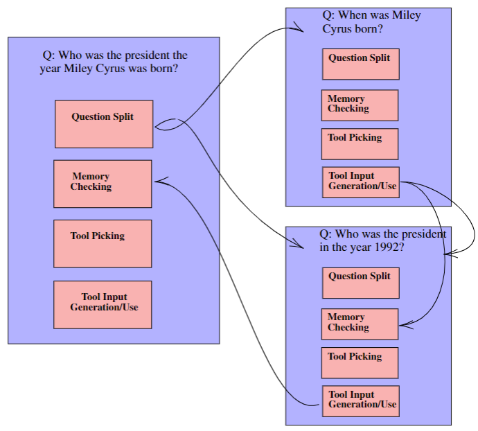

*Figure 1: The Rebel Pipeline for each subquestion*
# REBEL

Welcome to the REBEL repository! 

## Table of Contents
- [Reproducibility](#reproducibility)
- [Abstract](#abstract)
- [Methods](#methods)
- [Evaluation](#evaluation)
- [Experimental](#experimental-setup)
- [Results](#results)
- [Authors](#authors)

## Reproducibility
First run
```
pip install -r requirements.txt
```

To run the REBEL agent run 
```
python quickstart_REBEL.py
```
in the root LLM-VM directory. In the quickstart_REBEL.py file it is shown how one can use the LLM-VM client function to declare tools and use the REBEL agent. 

The quickstart_REBEL.py file allows you to run REBEL with any tool that you want to, but to run tests on the compositional celebrities dataset, run 

```
python test_agent.py
```
in the REBEL directory. After running test_agent.py you will see a menu like this:

```
0 birthplace_rounded_lat
1 birthplace_rounded_lng
2 birthplace_tld
3 birthplace_ccn3
4 birthplace_currency
5 birthplace_currency_short
6 birthplace_currency_symbol
7 birthplace_jpn_common_name
8 birthplace_spa_common_name
9 birthplace_rus_common_name
10 birthplace_est_common_name
11 birthplace_urd_common_name
12 birthplace_callingcode
13 birthyear_nobelLiterature
14 birthdate_uspresident
15 birthyear_masterchamp
```
Enter the number of the category you want to test, and then press enter to start the experiment. 
Below we present data on the REBEL agent and its merits. 

## Abstract

* While large language models (LLMs) have demonstrated impressive performance in question answering tasks, their performance is limited when the questions require knowledge that is not included in the model’s training data and can only be acquired through direct observation or interaction with the real world. 
* Existing methods decompose reasoning tasks through the use of modules invoked sequentially, limiting their ability to answer deep reasoning tasks. 
* We introduce a method, Recursion based extensible LLM (REBEL), which handles open-world, deep reasoning tasks. REBEL allows LLMs to reason via recursive problem decomposition and utilization of external tools. 

## Methods
<p align="center" width="100%">
    
</p>

*Figure 2: REBEL recursive reasoning and data flow*


* We split each question recursively into subquestions in order to solve
compositional tasks.
* We stop recursive splitting when a generated subquestion has a embedded
cosine similarity of 98 percent with the question it was generated for.
* We allow the use of any external tool that can be defined by a GET/POST
request to an API endpoint.
* The REBEL system contains a numbered list of the tools we have available and
their descriptions. For each subquestion, we determine if a tool is required to
determine an answer, and which number tool is required.
* We append all answers to subquestions to a "facts" list, and use this to inform
the answering of all subsequent subquestions.
* For each subquestion, REBEL uses a pipeline of Question Splitting, Memory
Checking, Tool Picking, and Tool Input Generation to determine an answer.
## Evaluation

In this section we first introduce the experimental setup, including the benchmarks used for evaluation, and then present the results. 

## Experimental Setup

* We tested REBEL on 3 datasets: Compositional Celebrities (Ofir Press, 2022), FEVER (Thorne et al., 2018), and
HotPotQA (Yang et al., 2018). 
* On these datasets, correctness was determined by a human experimenter based on the output of each system. ReAct outputs with simply the answer to the question, while REBEL
often outputs the answer wrapped in reasoning behind the system’s thoughts. 
* Our code, which can be found at in this directory, was implemented in Python using the OpenAI Completion API to access GPT-3 (da-vinci-003).

## Results

* We found that REBEL outperformed ReAct on answering questions that require i) the gathering of many facts to determine an answer ii) very specific search queries that return large amounts of unstructured data. 

* Below is the table depicting the results of the REBEL system versus ReAct on Compositional Celebrities.


* Below is the table depicting the results of the REBEL systhem versus ReAct on HotPotQA and FEVER.


## Authors 

Meet the awesome minds behind REBEL:

- **Abhigya Sodani** - Research Intern at Anarchy and UCLA student
  - GitHub: [abhigya-sodani](https://github.com/abhigya-sodani)
  - LinkedIn: [Abhigya Sodani](https://www.linkedin.com/in/abhigya-sodani-405918160/)

- **Dr. Matthew Mirman** - CEO of Anarchy, PhD ETH Zurich
  - GitHub: [Matthew Mirman](https://github.com/mmirman)
  - LinkedIn: [Matthew Mirman](https://www.linkedin.com/in/matthewmirman/)

These talented individuals have brought their expertise and passion to make REBEL a reality. Connect with them and get to know more about their contributions.

Feel free to reach out to us if you have any questions or feedback. Happy coding! 🎉🚀


